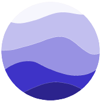
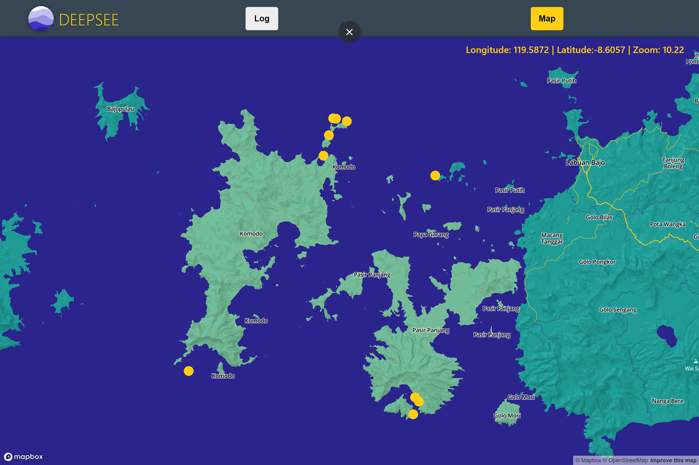
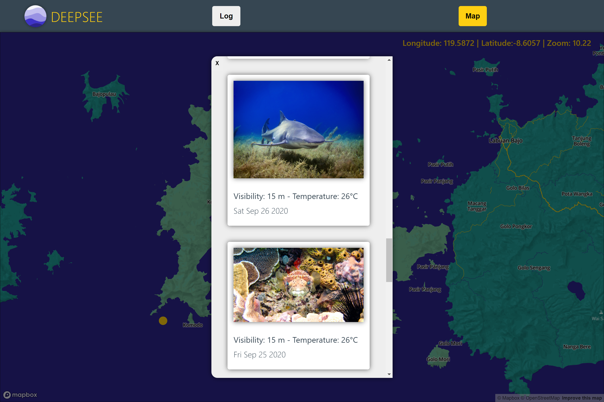

# DEEPSEE

 

  

 

DEEPSEE is an app designed to help scuba divers make informed decisions about their next dives and aims to replace the conventional divers log book. It aims to acheive this by providing a database of user submitted images & metadata of dives that have been recently logged all packaged in a sleek and functional UI.

## Table of Contents

[Screenshots](#Screenshots)

[Getting Started](#Getting-Started)

[Tech Stack](#Tech-Stack)

## Screenshots

 

  

  

  

 

## Getting Started

These instruction will help you setup a local development instance of the app.

- You will require Node and MongoDB on your machine to run the app.

- Clone the repo: `git clone https://github.com/SteHeRa/DEEPSEE.git`

- Install server dependencies: `npm install`

- Install client dependencies:
  `cd client`
  `npm install`

- Create a `.env` file in the client directory (`/client/.env`) and fill it following the example `/client/.env.example`. You will be required to provide your own [mapbox](https://www.mapbox.com/) access code.

- You are now ready to build and run the app. Run `npm start` in the parent directory and the client directory.

## Tech Stack

### Front End

- [React](https://reactjs.org/)
- [MapboxGL](https://docs.mapbox.com/mapbox-gl-js/api/)

### Back End

- [Express](https://expressjs.com/)
- [Mongoose](https://mongoosejs.com/)
- [Cloudinary](https://www.npmjs.com/package/cloudinary)

## Author

Stephen Head-Rapson - [Github](https://github.com/SteHeRa) - [LinkedIn](https://www.linkedin.com/in/stephen-head-rapson/)

## License

This project is licensed under the MIT License.
